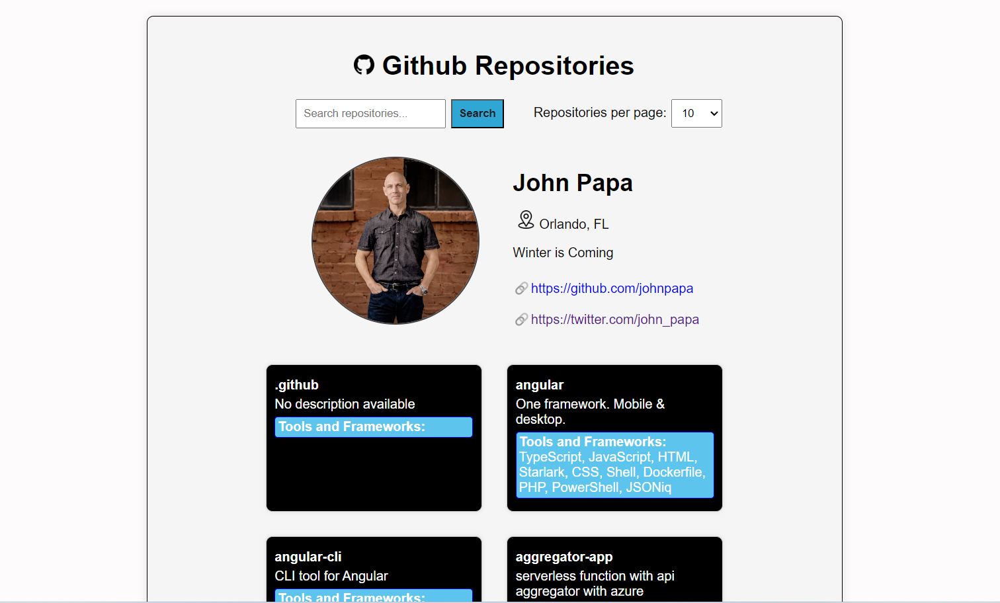

# Github Repositories Listing Page

This project is a simple web application that allows users to explore public GitHub repositories belonging to any GitHub user. Users can search for a specific GitHub username, view detailed information about the user, and explore their repositories. The application provides a clean and responsive interface, making it easy for users to navigate and discover GitHub repositories.

## Features

- **Search Repositories**: Enter a GitHub username to search for and display information about the user.

- **Pagination**: Customize the number of repositories displayed per page.

- **Responsive Design**: The application is designed to be responsive, ensuring a good user experience across different devices.

## Preview
1.	Default User
 
 
2.	Searching for another profile

 
## How to Use?

1. Clone the repository:

   git clone https://github.com/sirajk2508/Github-Repositories-listing-page.git

2. Open the `index.html` file in your web browser.

3. Enter a GitHub username in the search bar and click the "Search" button.

4. Explore the user information, repositories, and customize the number of repositories per page.

## Technologies Used

- HTML
- CSS
- JavaScript
- GitHub API

## Project Structure

The project is structured with separate JavaScript files for modularity and maintainability:

- `script.js`: Main script file that handles user input, displays user information, and repositories.

- `displayUserInfo.js`: Module for fetching and displaying user information.

- `displayRepositories.js`: Module for fetching and displaying repositories.

- `showErrorMessage.js`: Module for displaying error messages.

-`utils.js`: Module for reusing variables in other files.

- `style.css`: Stylesheet for the web application.
